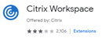

## Q: How do I get started?
A: Now that you are logged in:
- Launch any Apps from the Launcher, the circle in the bottom left.
- Pin any frequently used Apps like Gmail to the Shelf (the bar at the bottom of the screen).
  - __How to Pin:__ Open the Launcher. Find the app you want, right click and select Pin to shelf.
- Click on the bottom right corner to find:
  - Settings
  - Network
  - Sign Out

## Q: Will my keyboard shortcuts change?
A: Yes, every device has different shortcuts, here are some tips:
- __Scroll:__ Use two fingers on the trackpad to scroll.
- __Right Click:__ Press two fingers on the trackpad.
- __Screen Capture:__ _Whole screen_; Ctrl +  or (Ctrl + F5). _Part of a screen_; Ctrl + Shift +  or (Ctrl + Shift + F5).
- __Lock Your Screen:__ Press  + L or (Search Key + L)
- __To See All Key Commands:__ Ctrl + Alt + ?

## Q: How do I print?
A: Review how to [Install Google Cloud Print](https://whirlpool.service-now.com/kb_view.do?sys_kb_id=833636860f19ab8c2f555d78a1050e74&sysparm_rank=5&sysparm_tsqueryId=a71d8d1bdb453384175ef698f49619ce) and [Using Google Cloud Print.](https://whirlpool.service-now.com/kb_view.do?sys_kb_id=ea3636860f19ab8c2f555d78a1050e11&sysparm_rank=2&sysparm_tsqueryId=a71d8d1bdb453384175ef698f49619ce)

## Q: How do I connect to Wireless (WiFi)?
A: Connecting to WiFi depends on your location:
- __To connect to WiFi at a Whirlpool building:__ You’re automatically connected to Whirlpool’s UWLAN network any time you are at a Whirlpool facility.  
- __To connect to WiFi at home or hotel:__  Click on the wifi logo in the bottom right-hand side of your screen, choose their WiFi network, follow any prompts and off you go! Check out this [Google Support Doc](https://support.google.com/chromebook/answer/1047420?hl=en) for help. 

## Q: Do I need to use a VPN?
A: If you are traveling and cannot access a Whirlpool internal website then a VPN connection is needed. Look at the links below on how to use the VPN:
- [GlobalProtect VPN Instructions](https://whirlpool.service-now.com/kb_view.do?sys_kb_id=3d25022edbd9fec005577ee5bf9619b4&sysparm_rank=1&sysparm_tsqueryId=6b7e50d7db49bf44175ef698f49619fe)
- [GlobalProtect Video Example](https://drive.google.com/file/d/1tWrzy2agrBTF7r-oD3_abrJbTwM22VTP/view)  

## Q: How do I access SAP?
A: You will need to launch Citrix Workspace to use myapps.whirlpool.com.
- Go to the Chrome Web Store and search for [Citrix Workspace](https://chrome.google.com/webstore/detail/citrix-workspace/haiffjcadagjlijoggckpgfnoeiflnem?utm_source=chrome-ntp-icon). 

- Select Citrix Workspace app and install it.
- Once installed, you can open Citrix Workspace by clicking on the Launcher and then finding the Citrix Workspace icon.
- The first time you access Citrix, you will have to enter the URL https://myapps.whirlpool.com/
